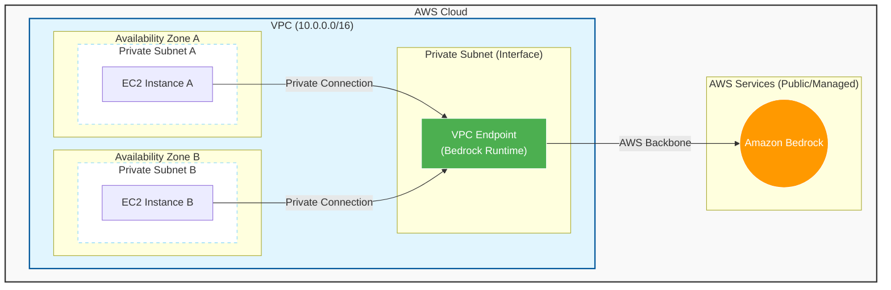

この構成図は、VPC内のEC2からAWS PrivateLink (VPC Endpoint) を経由して、Amazon Bedrockにプライベートに接続する構成を示しています。

```mermaid
graph TD
    subgraph AWSCloud ["AWS Cloud"]
        subgraph VPC ["VPC (10.0.0.0/16)"]
            subgraph AZ_A ["Availability Zone A"]
                subgraph Subnet_A ["Private Subnet A"]
                    EC2_A["EC2 Instance A"]
                end
            end

            subgraph AZ_B ["Availability Zone B"]
                subgraph Subnet_B ["Private Subnet B"]
                    EC2_B["EC2 Instance B"]
                end
            end

            subgraph Subnet_Shared ["Private Subnet (Interface)"]
                VPCE["VPC Endpoint<br>(Bedrock Runtime)"]
            end
        end

        subgraph AWS_Services ["AWS Services (Public/Managed)"]
            Bedrock(("Amazon Bedrock"))
        end
    end

    %% Connections
    EC2_A -->|Private Connection| VPCE
    EC2_B -->|Private Connection| VPCE
    VPCE -->|AWS Backbone| Bedrock

    %% Styling
    style AWSCloud fill:#f9f9f9,stroke:#333,stroke-width:2px
    style VPC fill:#e1f5fe,stroke:#01579b,stroke-width:2px
    style Subnet_A fill:#ffffff,stroke:#81d4fa,stroke-dasharray: 5 5
    style Subnet_B fill:#ffffff,stroke:#81d4fa,stroke-dasharray: 5 5
    style Bedrock fill:#ff9900,stroke:#fff,color:#fff
    style VPCE fill:#4caf50,stroke:#fff,color:#fff
```
