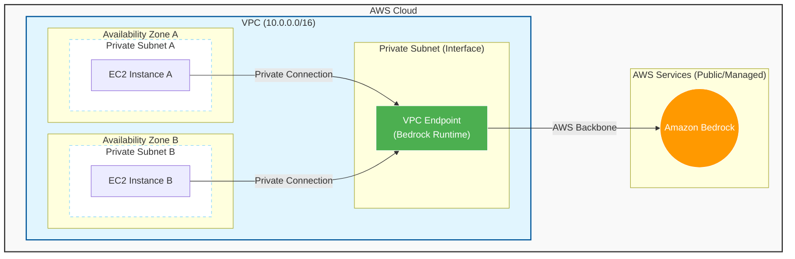
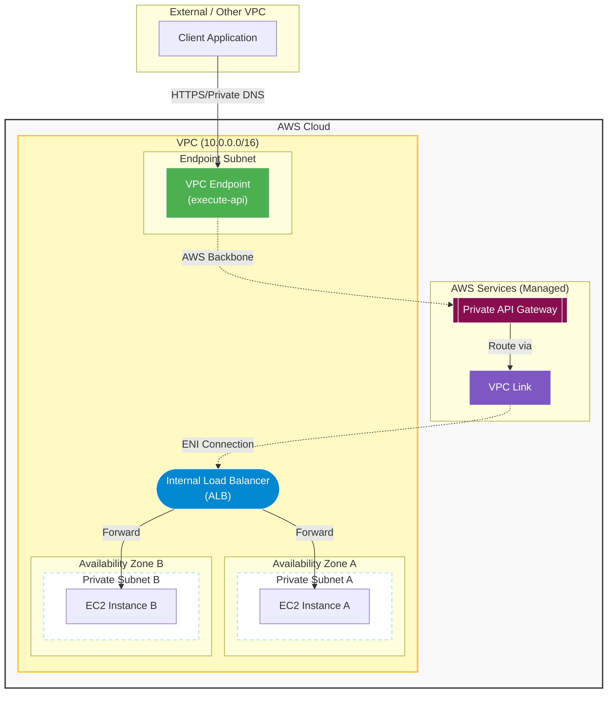

この構成図は、VPC内のEC2からAWS PrivateLink (VPC Endpoint) を経由して、Amazon Bedrockにプライベートに接続する構成を示しています。

この構成図は、Interface VPC Endpointを経由してPrivate API Gatewayにアクセスし、そこからVPC LinkおよびInternal Load Balancer（ALB）を通じてEC2インスタンスへ通信する、完全にクローズドなネットワーク構成を示しています。

## 構成図 (Mermaid)

